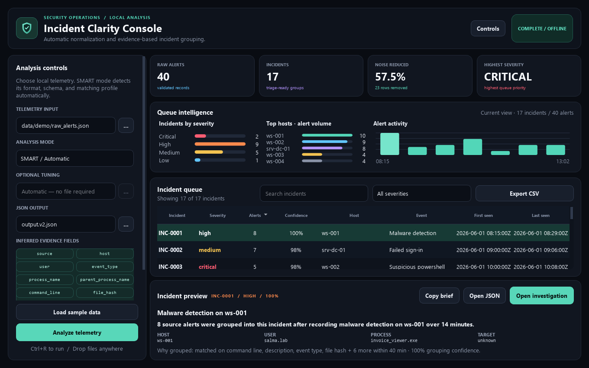
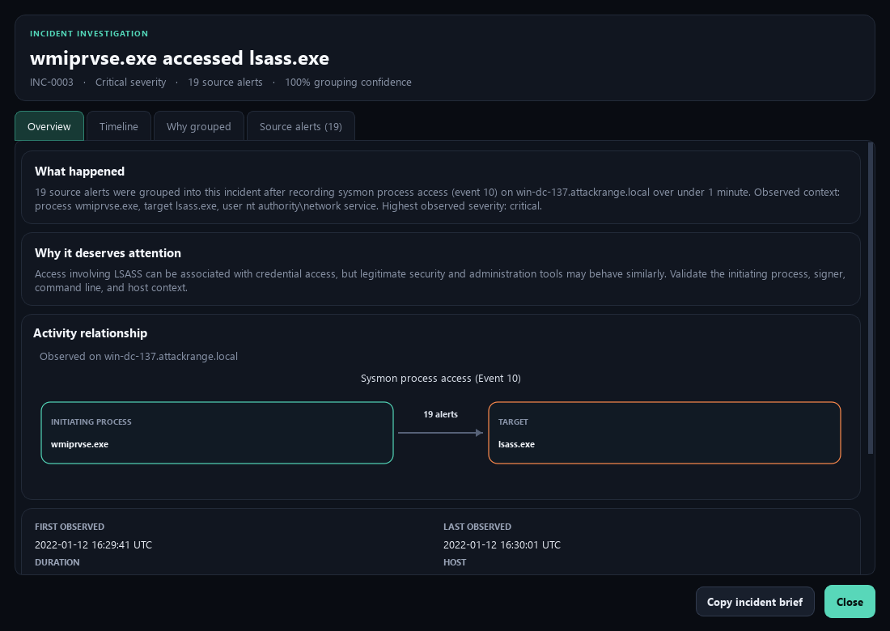

# SOC Alert Deduplicator

SOC Alert Deduplicator is an offline desktop and command-line application for turning heterogeneous security telemetry into an explainable incident queue. Version 2 detects common input formats and field layouts automatically, infers a matching profile from each batch, and groups repeated activity without requiring a source-specific configuration file. Version 2.1 adds a visual investigation workspace so analysts can understand what happened, why it matters, and why records were grouped without reading raw JSON first.



## Highlights

- Automatic ingestion for JSON, JSON Lines/NDJSON, CSV, TSV, XML, Windows Event XML, CEF, LEEF, RFC 5424/BSD syslog, key-value logs, and plain text.
- Transparent schema mapping for nested and flat records, with source-format and source-record provenance on every normalized alert.
- Adaptive field selection, evidence weights, threshold, candidate blocking, and time-window inference.
- Conservative identity boundaries for hosts, file hashes, source processes, and target processes to prevent similarity chains from merging different activity.
- Explainable incident metadata and exported analyst views: plain-language title, event narrative, cautious risk context, grouping reason, recommended checks, confidence, evidence fields, time range, and every source alert ID.
- Live queue intelligence for severity distribution, host alert volume, and activity over time; all visuals react to the current search and severity filters.
- A resizable investigation window with Overview, Timeline, Why grouped, and Source alerts tabs, plus process-to-target and grouping-decision diagrams.
- Responsive dark desktop interface with multi-file drag and drop, numeric sorting, search, severity filtering, accessible chart descriptions, JSON output, and CSV export.
- Local processing only. Telemetry is not sent to a service.

## Verified results

| Dataset | Alerts | Incidents | Queue reduction | Lost or duplicate alert references |
|---|---:|---:|---:|---:|
| Reviewed sample | 40 | 17 | 57.5% | 0 |
| Splunk Attack Data T1003.001 | 8,050 | 450 | 94.41% | 0 |

The public T1003.001 run completes in approximately 11 seconds on the development machine. That measurement is a reproducibility result, not a claim about universal detection quality. The source is controlled attack-emulation telemetry and has no duplicate ground-truth labels. See [Real-data validation](docs/real_data_test.md).

## Install

Requirements: Python 3.11 or newer. The desktop interface runs on Windows, macOS, and Linux environments supported by PySide6.

```powershell
git clone <repository-url>
cd soc-alert-deduplicator
python -m venv .venv
.\.venv\Scripts\Activate.ps1
python -m pip install --upgrade pip
pip install -e .
```

## Desktop application

```powershell
soc-alert-deduplicator-gui
```

Select one or more telemetry files, choose an output path, and run the analysis. SMART mode is the default and requires no configuration. Search and severity filters update both the incident table and the queue visuals. Select a row for a concise preview, then double-click it or choose **Open investigation** for the complete evidence view. The **Controls** button collapses the input panel when more queue space is needed.



Open the bundled sample immediately:

```powershell
soc-alert-deduplicator-gui --demo
```

## Command line

Run the adaptive pipeline on one file:

```powershell
soc-alert-deduplicator `
  --input data/demo/raw_alerts.json `
  --output output.v2.json
```

Combine different formats in one batch by repeating `--input`:

```powershell
soc-alert-deduplicator `
  --input alerts.ndjson `
  --input gateway.cef `
  --input endpoint-events.csv `
  --output incidents.json
```

Each SMART run also writes an adjacent profile document, such as `incidents.profile.json`. It records detected formats, mapped fields, warnings, inferred weights, threshold, continuity window, input count, incident count, and reduction percentage.

Normalize without grouping:

```powershell
soc-alert-normalize `
  --input firewall.log `
  --input endpoint-events.xml `
  --output normalized-alerts.json
```

The original exact-match engine remains available for deterministic policy-based workflows:

```powershell
soc-alert-deduplicator `
  --mode exact `
  --input data/demo/raw_alerts.json `
  --config config.json `
  --output exact-incidents.json
```

## Input behavior

The importer recognizes:

| Family | Accepted forms |
|---|---|
| JSON | arrays, single objects, common `events`/`alerts`/`records` wrappers, Elastic-style `hits.hits`, JSON Lines, NDJSON |
| Delimited | comma, semicolon, tab, or pipe-delimited records with headers |
| XML | generic event collections and exported Windows Event XML streams |
| Security text | CEF, LEEF 1/2, RFC 5424 syslog, BSD syslog, key-value lines, plain text |
| Compression | `.gz` files and `.zip` archives with expansion and member-count limits |

Direct binary `.evtx`, packet captures, office documents, and proprietary binary formats are rejected instead of being guessed. Export Windows events as XML before ingestion. Missing or unrecognized timestamps use source file metadata and produce a warning in the profile document.

All normalized records contain the required alert contract:

```json
{
  "alert_id": "AUTO-1A2B3C4D5E6F",
  "timestamp": "2026-07-01T12:00:00Z",
  "source": "endpoint-sensor",
  "host": "ws-01",
  "event_type": "process_access",
  "severity": "high",
  "process_name": "rundll32.exe",
  "target_process_name": "lsass.exe",
  "command_line": "rundll32.exe example.dll,Entry",
  "detected_format": "cef",
  "source_record": "gateway.cef:18"
}
```

Aliases cover common vendor and ECS-like names. Nested objects are flattened for matching while the normalized output remains predictable.

## How SMART matching works

```mermaid
flowchart LR
    Files["Raw telemetry files"] --> Detect["Detect format and decode safely"]
    Detect --> Map["Map to normalized alert fields"]
    Map --> Profile["Infer coverage, weights, threshold, and window"]
    Profile --> Block["Build identity-aware candidate blocks"]
    Block --> Score["Score available evidence"]
    Score --> Guard["Apply identity and time boundaries"]
    Guard --> Incidents["Write incidents and profile evidence"]
```



The engine normalizes paths, case, whitespace, volatile command-line numbers, GUIDs, and long hexadecimal tokens. It then scores only candidates from recent identity-aware blocks. A match must have enough evidence and exceed the inferred threshold. Host, file-hash, process, target-process, event, and time checks prevent cluster drift.

SMART matching is deliberately explainable rather than probabilistic. It does not call an external model, execute log content, or label activity as malicious or benign.

## Optional SMART tuning

Most datasets should run with no tuning file. For controlled environments, a small JSON document can override the inferred choices:

```json
{
  "threshold": 0.88,
  "time_window_minutes": 20,
  "min_evidence_fields": 3,
  "exclude_fields": ["description"],
  "field_weights": {
    "file_hash": 7.0,
    "host": 4.0
  },
  "max_candidates": 150
}
```

Pass it with `--config smart-tuning.json`. No field mapping is required. See [Configuration](docs/configuration.md) for validation rules and trade-offs.

## Safety model

- Input is read as data and never executed.
- Duplicate JSON keys, malformed records, unsafe encodings, oversized expanded archives, encrypted ZIP members, and invalid normalized alerts are rejected.
- Input and tuning files cannot be overwritten as output.
- JSON and CSV writes use temporary files and atomic replacement.
- CSV export neutralizes common spreadsheet-formula prefixes.
- Every accepted alert ID appears in exactly one output incident.

Deduplication is a triage aid, not a security verdict. Sparse telemetry can still produce false merges or false splits, and public attack-emulation data does not represent every operational environment. Review [Threat model and limitations](docs/threat_model.md) before using the output operationally.

## Testing

```powershell
pip install -r requirements-dev.txt
ruff check .
ruff format --check .
mypy src
pytest
coverage run -m pytest
coverage report
```

The 262-test suite covers ingestion formats, nested mappings, compression, configuration validation, adaptive profiling, process-identity drift prevention, time boundaries, deterministic exact mode, analyst narratives, native chart rendering, investigation interactions, JSON/CSV safety, package metadata, CLI behavior, and desktop behavior. Branch-aware engine coverage is enforced at 95%.

## Documentation

- [Architecture](docs/architecture.md)
- [Configuration](docs/configuration.md)
- [Desktop interface](docs/desktop_ui.md)
- [Demo and verification](docs/demo.md)
- [Real-data validation](docs/real_data_test.md)
- [Threat model and limitations](docs/threat_model.md)
- [Release verification](docs/release_verification.md)

## License and data provenance

Application code is released under the [MIT License](LICENSE). The optional Splunk Attack Data fixture retains its upstream Apache-2.0 license, commit pin, metadata, and checksums under `data/external/splunk_attack_data/T1003.001/`.
