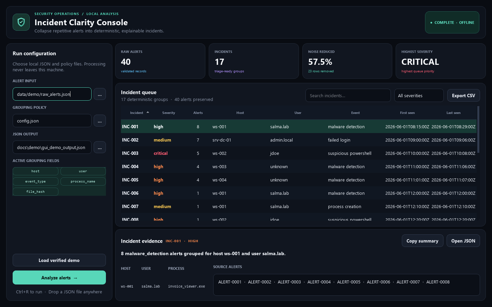
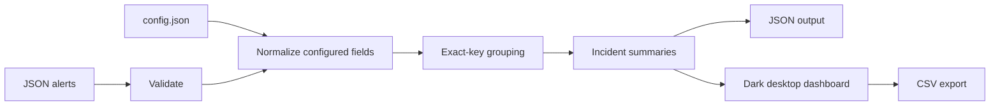

# SOC Alert Deduplicator

An explainable, offline-first Python tool that turns repetitive JSON security alerts into deterministic incident summaries. It includes both a production-style CLI and a modern dark desktop dashboard for analyst workflows.



## Verified demo result

| Measure | Before | After |
|---|---:|---:|
| Queue items | 40 alerts | 17 incidents |
| Noise reduction | — | **57.5%** |
| Lost alert references | — | **0** |
| Highest severity | — | Critical |

The benchmark is automated: every one of the 40 synthetic alert IDs appears exactly once, and generated JSON must match the reviewed oracle byte for byte.

## The problem

SOC analysts often review many alerts that describe the same underlying activity. Repeated detections for one host, user, process, or file hash increase triage time and make the queue harder to prioritize.

This project collapses those repetitions into incident-oriented summaries while preserving the source alert IDs, severity, time range, and grouping evidence. The result is smaller and easier to investigate without pretending that simple matching is a complete correlation engine.

## Who it is for

- **SOC analysts** who need a clearer batch triage queue.
- **SOC administrators and detection engineers** who need explainable, configurable grouping rules.
- **Security engineering reviewers** evaluating deterministic data pipelines, validation, testing, and risk awareness.

## What it does

- Validates UTF-8 JSON alerts, required fields, timestamps, severities, hashes, and unique IDs.
- Normalizes configured grouping values without mutating source records.
- Groups exact normalized tuples in deterministic first-seen order.
- Aggregates alert counts, severity, timestamps, context, and source IDs.
- Writes JSON atomically and exports analyst-friendly CSV from the GUI.
- Handles omitted, null, blank, case-varied, and space-padded optional values.
- Rejects malformed inputs and unsafe output collisions with concise errors.
- Runs entirely on the local machine; no alert data is sent over a network.



## Quick start

Requirements: Python 3.11+ and Windows, macOS, or Linux with a desktop environment.

```powershell
git clone <repository-url>
cd soc-alert-deduplicator
python -m venv .venv
.\.venv\Scripts\Activate.ps1
python -m pip install --upgrade pip
pip install -e .
```

### Launch the desktop dashboard

```powershell
soc-alert-deduplicator-gui
```

Select the alert input, configuration, and JSON output paths, then choose **Analyze alerts**. You can search the incident queue, filter by severity, inspect source alert IDs, copy a summary, open the JSON, or export CSV.

To open the verified demo immediately:

```powershell
soc-alert-deduplicator-gui --demo
```

### Run the CLI

```powershell
soc-alert-deduplicator `
  --input data/demo_before.json `
  --config config.json `
  --output output.json
```

Expected terminal output:

```text
Processed 40 alerts into 17 incidents.
Output written to output.json.
```

Running without installation is also supported:

```powershell
$env:PYTHONPATH = "src"
python -m soc_alert_deduplicator --input data/demo_before.json --config config.json --output output.json
python -m soc_alert_deduplicator.gui --demo
```

## Input and output

Minimal input alert:

```json
{
  "alert_id": "ALERT-0001",
  "timestamp": "2026-06-01T08:15:00Z",
  "source": "mock-wazuh",
  "host": "WS-001",
  "user": "salma.lab",
  "event_type": "malware_detection",
  "process_name": "invoice_viewer.exe",
  "file_hash": "a7f3c9d1e8b2456a9c01d02f5d33b71c4e8a6b9d2f1073c5e6a8b1d4f9c2e7a0",
  "severity": "high"
}
```

Condensed incident output:

```json
{
  "incident_id": "INC-001",
  "alert_count": 8,
  "host": "ws-001",
  "user": "salma.lab",
  "event_type": "malware_detection",
  "severity": "high",
  "first_seen": "2026-06-01T08:15:00Z",
  "last_seen": "2026-06-01T08:29:00Z",
  "alert_ids": ["ALERT-0001", "ALERT-0002"],
  "summary": "8 malware_detection alerts grouped for host ws-001 and user salma.lab."
}
```

The complete contract is documented in [the concept document](docs/concept.md).

## Configuration

Grouping behavior is controlled without changing Python code:

```json
{
  "group_by": ["host", "user", "event_type", "process_name", "file_hash"],
  "case_sensitive": false,
  "missing_value": "unknown",
  "minimum_match_score": 1.0
}
```

Version 1 deliberately supports exact matching only. See [Configuration](docs/configuration.md) for supported fields, validation rules, and safe tuning guidance.

## Demo and proof

- [`data/demo_before.json`](data/demo_before.json): 40 synthetic Wazuh/Sysmon-inspired alerts.
- [`data/demo_after.json`](data/demo_after.json): 17 reviewed incident summaries.
- [Demo walkthrough](docs/demo.md): reproducible GUI and CLI steps.
- [Dataset design](docs/dataset_design.md): scenarios, edge cases, and oracle rationale.
- [Data research](docs/data_research.md): source-field research and public-safety decisions.

## Testing

Install development tools and run the complete gate:

```powershell
pip install -r requirements-dev.txt
pytest
coverage run -m pytest
coverage report
ruff check .
ruff format --check .
mypy src
```

The suite covers configuration, validation, normalization, grouping, aggregation, atomic JSON/CSV output, CLI behavior, the benchmark oracle, and desktop interactions. The processing engine enforces 100% statement and branch coverage; GUI layout code is validated with focused Qt smoke and interaction tests.

## Security model and limitations

The application treats alert and configuration files as untrusted input, never executes field values, avoids printing raw records in errors, protects input files from output overwrite, and writes results atomically.

Important limitations:

- Exact rule-based grouping can over-group unrelated alerts or under-group related activity.
- Missing context can push several sparse alerts into the same `unknown` bucket.
- There is no time-window constraint, fuzzy scoring, campaign correlation, or machine learning.
- The application processes local batches; it is not a live SIEM connector or response platform.
- A malicious actor who controls grouping fields may shape alerts to evade or influence clustering.

Read the full [Threat Model and Limitations](docs/threat_model.md) before applying the tool to operational data. Analysts must treat grouped incidents as triage aids, not as proof that activity is benign or identical.

## Repository structure

```text
soc-alert-deduplicator/
├── config.json
├── data/
│   ├── demo_before.json
│   ├── demo_after.json
│   └── demo/
├── docs/
│   ├── demo/
│   ├── architecture.md
│   ├── configuration.md
│   ├── demo.md
│   └── threat_model.md
├── src/soc_alert_deduplicator/
│   ├── assets/
│   ├── gui.py
│   └── processing modules
├── tests/
├── pyproject.toml
├── requirements.txt
└── requirements-dev.txt
```

## Roadmap

- Configurable time-window grouping.
- Field mapping for native Wazuh and Sysmon exports.
- Near-duplicate scoring with transparent evidence.
- Signed desktop builds and release automation.
- Performance benchmarks for large alert batches.
- Optional live SIEM ingestion, kept separate from the deterministic core.

## Documentation

- [Architecture](docs/architecture.md)
- [Desktop interface](docs/desktop_ui.md)
- [Configuration](docs/configuration.md)
- [Demo walkthrough](docs/demo.md)
- [Threat model](docs/threat_model.md)
- [Use cases](docs/use_cases.md)
- [Phase completion record](docs/phase_completion.md)

## License

Released under the [MIT License](LICENSE).
