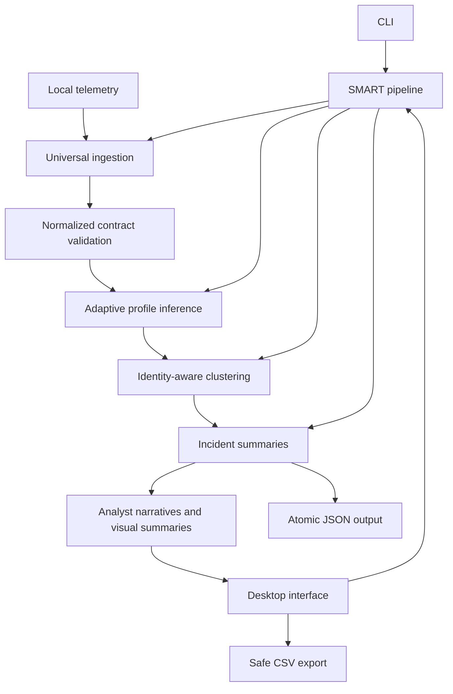

# Architecture

## System boundary

SOC Alert Deduplicator is a local batch processor with two presentation layers: a command-line interface and a PySide6 desktop interface. Both call the same ingestion, validation, profiling, deduplication, and output modules. The application has no runtime network dependency and does not execute telemetry content.

## Module responsibilities

| Module | Responsibility |
|---|---|
| `universal_import.py` | Format detection, safe decoding, archive limits, field flattening, alias mapping, timestamp/severity normalization, provenance |
| `io.py` | Normalized alert validation, duplicate-ID checks, timestamp parsing, protected paths, atomic JSON output |
| `smart_profile.py` | Coverage and cardinality statistics, evidence-field selection, blocking fields, weights, threshold, continuity window, optional tuning |
| `smart_deduplication.py` | Value normalization, evidence scoring, hard identity boundaries, candidate indexing, continuity checks, clustering, incident metadata |
| `smart_pipeline.py` | End-to-end orchestration and profile sidecar generation |
| `insights.py` | Renderer-independent titles, narratives, risk context, grouping explanations, recommendations, queue summaries, and timeline buckets |
| `investigation.py` | Native Qt charts, relationship/grouping diagrams, source-alert model, and four-tab investigation dialog |
| `gui.py` | Responsive controls, queue model/view, numeric sorting, filter-aware visuals, incident preview, desktop actions |
| `config.py`, `normalization.py`, `deduplication.py`, `summaries.py` | Backward-compatible exact-policy engine |
| `raw_import.py` | Detailed Windows Event XML and CrowdStrike mappings reused by universal ingestion |
| `exports.py` | Atomic CSV export and formula-injection neutralization |

## Ingestion pipeline

### Safe decoding

The importer reads at most 256 MiB of expanded content per file. ZIP archives are limited to 128 members and 256 MiB total declared expansion. Encrypted members are rejected. Text decoding supports UTF-8 with or without BOM, validated UTF-16, and CP1252 fallback. Control-heavy or null-containing binary data is rejected.

### Format detection

Detection uses file suffixes only when the suffix conveys a strong contract, such as `.jsonl`, `.tsv`, `.gz`, or `.zip`. Content markers distinguish JSON, XML, CEF, LEEF, RFC/BSD syslog, key-value logs, and plain text. Delimited inputs use Python's `csv.Sniffer` with a restricted delimiter set.

RFC syslog priorities such as `<134>` are tested before XML parsing so they cannot be misclassified as tags. Windows Event XML uses the source-specific parser when its schema namespace is present; generic XML uses scalar descendants and repeated record elements.

### Field mapping

Records are flattened into dotted paths. The mapper indexes every useful suffix, allowing fields such as `_source.host.name`, `device.hostName`, and `hostname` to reach the same normalized host field. A documented alias table maps common identity, process, target, hash, event, severity, timestamp, and description names.

Generated `AUTO-*` IDs are deterministic hashes of source provenance, record position, and canonical record content. Duplicate IDs across combined files receive a deterministic provenance suffix.

## Adaptive profile inference

For every normalized field, the profiler calculates:

- coverage: the fraction of alerts with a usable value;
- distinct ratio: unique values divided by populated values; and
- repetition: the complement of distinct ratio.

Fields with useful coverage become evidence fields. High-value identity attributes receive larger base weights. Blocking fields are selected from file hash, host, event type, source, and process when their coverage supports efficient candidate lookup.

The threshold becomes stricter for sparse batches and slightly broader for high-coverage, repetitive batches. Median inter-event cadence produces a continuity window clamped to 5–120 minutes. Optional tuning can override these decisions, but ordinary use does not require a file.

The inferred settings are serialized to a deterministic `SP-*` profile ID and written beside the output for review and reproduction.

## Matching and clustering

### Value normalization

- text is trimmed, case-folded, and whitespace-collapsed;
- process paths are reduced to the executable basename;
- GUIDs, long hexadecimal values, and standalone numbers in command lines are replaced with stable tokens; and
- long descriptions and command lines use token-set similarity rather than expensive character alignment.

### Candidate blocking

Alerts are processed in timestamp order. Candidate clusters are selected using strong compound keys such as host/event/process/target and host/hash. Index buckets are ordered by last activity, expired entries are removed, and candidates are capped. This avoids full pairwise comparison while keeping deterministic results.

### Identity guards

Host and file-hash disagreement are hard conflicts. Populated source-process and target-process names must match after basename normalization. Each cluster retains its first populated identity anchors so an early record with missing values cannot act as a bridge between different process families. Event identity, minimum evidence, continuity gap, and maximum cluster span provide additional boundaries.

### Evidence score

Available fields are scored independently. Missing values contribute neither positive nor negative weight. The match score is the weighted mean of similarities, adjusted for evidence coverage. A candidate must meet the minimum evidence count and threshold. The selected match records its contributing fields and confidence.

Each alert belongs to exactly one cluster. Incident order follows the first input position represented by each cluster, preserving a stable analyst-facing sequence.

## Output contract

Each SMART incident includes:

- incident ID and alert count;
- host, user, process, target process, event, hash, and severity context;
- first and last timestamps;
- all source alert IDs;
- human-readable summary and structured `analyst_view` with title, event narrative, cautious risk context, grouping reason, and recommended checks;
- `SMART` engine marker, profile ID, match type, confidence, evidence fields, and continuity window; and
- contributing source formats.

The adjacent profile document records detected input formats, paths, record counts, mapped fields, warnings, inferred profile values, and reduction metrics.

## Desktop architecture

The queue uses `QAbstractTableModel` and `QSortFilterProxyModel`. The source model exposes typed sort data through a dedicated role, so alert counts and confidence sort numerically while severity uses a defined rank. Filtering never mutates the incident list. The visible proxy rows drive the severity, host-volume, and activity summaries so the table and visual counts cannot disagree.

The investigation dialog applies progressive disclosure across Overview, Timeline, Why grouped, and Source alerts tabs. Custom `QPainter` widgets render dependency-light charts and diagrams while exposing equivalent accessible text. Source alerts remain in a table model rather than being expanded into thousands of widgets.

Qt layouts, splitters, a scrollable control region, and width-aware rearrangement keep the application usable on compact displays. Timestamp columns hide below the useful-width threshold, metrics move from four columns to two, and queue controls stack into a second row. The sidebar can be collapsed entirely.

## Determinism and failure behavior

- No random choices are used.
- Profile IDs derive from canonical inferred settings.
- Auto alert IDs derive from canonical record/provenance content.
- Sorting includes original position as a stable tie-breaker.
- Input validation happens before output replacement.
- Output writes use a temporary sibling file followed by atomic replacement.
- Domain failures return concise messages and nonzero CLI status without printing raw records.

## Scalability

The core engine is designed around bounded candidate comparison rather than all-pairs matching. On the included 8,050-record validation corpus, the conservative profile produces 450 incidents in approximately 11 seconds on the development machine. Runtime still depends on field sizes, batch cadence, inferred blocks, and storage performance; no universal throughput guarantee is implied.

## Compatibility mode

The exact engine remains available with `--mode exact` and `config.json`. It preserves the reviewed 40-alert/17-incident oracle byte for byte. Exact mode is useful when an organization requires a fixed tuple policy rather than adaptive evidence scoring.
