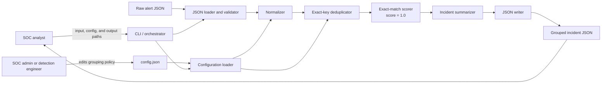

# Version 1 Architecture

## Executive Summary

The SOC Alert Deduplicator is a deterministic, local, batch-processing pipeline. It reads a JSON array and configuration, validates the inputs, normalizes only the fields required for grouping, creates exact-match groups, calculates incident metadata, and writes one JSON array of incident summaries.

The design favors explainability over cleverness: standard Python data structures, pure transformations where practical, no network access, and no machine-learning or fuzzy-clustering behavior in v1.

## 1. Design Goals

- Produce the same incidents for the same ordered input and configuration.
- Keep source data immutable while processing.
- Make every grouping decision explainable from `config.json`.
- Reject invalid required data rather than silently inventing it.
- Normalize missing optional context without crashing.
- Keep components small enough to test independently.
- Match the Phase 2 benchmark exactly.

## 2. Non-Goals

Version 1 does not provide:

- live Wazuh or SIEM ingestion;
- a web interface or database;
- fuzzy or machine-learning clustering;
- campaign correlation across hosts;
- a time-window constraint;
- source-specific field mapping;
- automated response actions.

## 3. System Architecture



The smallest required pipeline remains:

```text
JSON -> Parser -> Normalizer -> Deduplicator -> Output
```

The implementation-level flow is:

```text
load -> clean -> group -> score -> summarize -> output
```

## 4. Component Responsibilities

| Component | Responsibility | Must not do |
|---|---|---|
| CLI/orchestrator | Parse paths, call stages in order, set exit status | Contain grouping logic |
| Configuration loader | Read and validate grouping fields and normalization settings | Mutate alerts |
| JSON loader/validator | Decode UTF-8 JSON and validate the top-level/input contract | Normalize optional fields |
| Normalizer | Produce canonical grouping values from a copy of each alert | Modify the original input objects |
| Deduplicator | Build ordered groups from exact normalized tuples | Apply fuzzy similarity |
| Exact-match scorer | Record `1.0` for an exact tuple match | Pretend partial matching exists |
| Incident summarizer | Aggregate counts, times, IDs, grouping fields, and highest severity | Drop source alert references |
| JSON writer | Serialize the complete result deterministically | Write partial output after an earlier failure |

## 5. Proposed Package Boundaries

Phase 4 can implement the design with small modules:

```text
src/soc_alert_deduplicator/
    __init__.py
    main.py           # CLI and orchestration
    config.py         # configuration loading and validation
    io.py             # alert loading, input validation, and output writing
    normalization.py  # canonical grouping values
    deduplication.py  # ordered exact-key grouping
    summaries.py      # incident aggregation
```

The project should start with Python dictionaries and standard-library modules. Pandas is unnecessary for a 40-record benchmark and would obscure the core grouping logic.

## 6. Input Contract

The input is a UTF-8 JSON array. Every alert must contain:

- `alert_id`
- `timestamp`
- `source`
- `host`
- `event_type`
- `severity`

Optional context includes `user`, `process_name`, `parent_process_name`, `command_line`, `file_hash`, `rule_name`, and `description`.

Additional invariants:

- `alert_id` values are unique strings.
- `timestamp` values are ISO 8601 timestamps.
- `severity` is one of `informational`, `low`, `medium`, `high`, or `critical`.
- A present, nonblank `file_hash` in the demo is a 64-character hexadecimal SHA-256.
- Unknown extra fields may be preserved or ignored, but must not change v1 grouping.

## 7. Configuration Contract

The default configuration is:

```json
{
  "group_by": [
    "host",
    "user",
    "event_type",
    "process_name",
    "file_hash"
  ],
  "case_sensitive": false,
  "missing_value": "unknown",
  "minimum_match_score": 1.0
}
```

Validation rules:

- `group_by` must be a nonempty list of unique supported field names.
- `case_sensitive` must be boolean.
- `missing_value` must be a nonempty string.
- `minimum_match_score` must be numeric.
- Version 1 accepts only an exact threshold of `1.0`; lower thresholds are reserved for later similarity logic.

## 8. Normalization Contract

For every configured grouping field:

1. Read the value without mutating the raw alert.
2. Treat an absent key or `null` as the configured missing value.
3. Convert the value to text.
4. Trim leading and trailing whitespace.
5. Replace an empty result with the configured missing value.
6. Lowercase it when `case_sensitive` is `false`.

The ordered tuple of normalized values is the group key:

```python
(host, user, event_type, process_name, file_hash)
```

Fields such as command line and parent process remain evidence. They do not affect the v1 key.

## 9. Grouping and Scoring

A dictionary keyed by the normalized tuple provides explainable linear-time grouping. Python dictionaries preserve insertion order, so groups can be emitted in the order their first alert appears.

For v1:

- identical normalized tuples belong to the same incident;
- different tuples belong to different incidents;
- every accepted match has `match_score = 1.0`;
- there is no partial score.

The score stage exists as an explicit boundary so near-duplicate scoring can be added later without changing parsing, normalization, or output responsibilities.

## 10. Incident-Summary Contract

Each incident contains:

- sequential `incident_id`, based on first group appearance;
- `alert_count`;
- normalized `grouping_fields`;
- top-level normalized grouping values;
- highest member `severity`;
- earliest `first_seen`;
- latest `last_seen`;
- member `alert_ids` in input order;
- a deterministic human-readable `summary`.

Severity ordering is:

```text
informational < low < medium < high < critical
```

For the default Phase 2 benchmark, 40 alerts must produce 17 incidents identical to `data/demo/expected_incidents.json`.

## 11. Error Behavior

| Condition | Required behavior |
|---|---|
| Input/config file missing or unreadable | Stop with a concise path-specific error and nonzero exit status |
| Malformed JSON | Stop and report JSON line/column when available |
| Top-level JSON is not an array | Reject before grouping |
| Required alert field missing | Reject and identify the record index and alert ID when available |
| Duplicate `alert_id` | Reject before grouping |
| Invalid timestamp, severity, or hash shape | Reject with the affected alert ID |
| Optional field absent, `null`, or blank | Normalize it; do not fail |
| Unsupported config field or threshold | Reject configuration before loading output |
| Output cannot be written | Return nonzero; do not report success |

Errors should not echo full command lines or raw event bodies. The writer should create the final file only after all input has been processed successfully.

## 12. Determinism and Complexity

Deterministic rules:

- input array order is authoritative;
- incident order follows first group appearance;
- alert IDs within an incident preserve input order;
- `first_seen` and `last_seen` derive from timestamps;
- JSON output uses stable indentation and a final newline.

For `n` alerts and `k` grouping fields:

- time complexity is `O(n × k)`;
- memory complexity is `O(n)`;
- `k` is small and configuration-bounded.

## 13. Security and Privacy Boundaries

- Processing is local and requires no network connection.
- The program never executes values found in alert fields.
- Raw input objects remain unchanged.
- Error messages avoid dumping sensitive evidence.
- Demo data stays synthetic and public-safe.
- Output is written only to the user-selected path.
- Direct SIEM credentials and production connectivity remain out of scope.

## 14. Design Decisions and Tradeoffs

| Decision | Benefit | Known cost |
|---|---|---|
| Exact tuple grouping | Explainable and testable | Misses fuzzy duplicates |
| Include host in key | Prevents cross-endpoint over-grouping | Same campaign becomes several incidents |
| Normalize missing values | Robust to sparse alerts | Several context-poor alerts may over-group |
| Exclude command line from key | Avoids fragmentation from minor argument changes | Different commands may share an incident |
| No time window | Keeps v1 small | Distant activity can group together |
| Standard library and dictionaries | Transparent and lightweight | Fewer convenience abstractions |

## 15. Phase 3 Acceptance Checklist

- [x] Architecture diagram documents inputs, processing stages, configuration, and output.
- [x] Simple `load -> clean -> group -> score -> output` flow is defined.
- [x] Component responsibilities and proposed module boundaries are explicit.
- [x] Input, configuration, normalization, grouping, and output contracts are defined.
- [x] Deterministic ordering and benchmark behavior are defined.
- [x] Failure behavior and security boundaries are defined.
- [x] Deferred functionality is kept outside v1.

## References

- [Project concept](concept.md)
- [Data research](data_research.md)
- [Dataset design](dataset_design.md)
- [Expected Phase 2 incidents](../data/demo/expected_incidents.json)
- [Notion Phase 3 plan](https://app.notion.com/p/347ea4a7d0dd80f5ba8ece6eddbfe05b)

