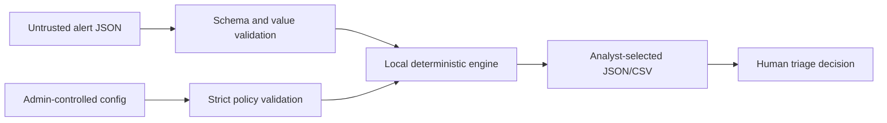

# Threat Model and Limitations

## Executive summary

The SOC Alert Deduplicator is a local batch-triage aid, not a security control or source of truth. Its most important risk is semantic: a technically valid grouping policy can merge alerts that represent different attacks. Analysts must retain access to source evidence and review grouping behavior before operational use.

## Scope and trust boundaries

In scope:

- local alert and configuration files;
- parsing, normalization, grouping, summarization, and export;
- the CLI and desktop interface; and
- integrity and confidentiality risks created by those boundaries.

Out of scope:

- SIEM authentication and transport;
- endpoint collection;
- multi-user authorization;
- cloud storage;
- automated containment or remediation; and
- proving whether an alert is a true positive.

## Assets to protect

- **Alert confidentiality:** hostnames, usernames, command lines, hashes, and investigation context may be sensitive.
- **Grouping integrity:** one source alert must map to exactly one incident under the selected policy.
- **Policy integrity:** grouping fields materially affect analyst conclusions.
- **Output availability:** a failed write must not leave a partial file reported as successful.
- **Analyst attention:** the tool must not create false confidence that reduced queue volume equals reduced risk.

## Threat analysis

| Threat | Example | Impact | Current controls | Residual risk |
|---|---|---|---|---|
| False grouping hides distinct attacks | Two unrelated alerts share broad fields | High | Explainable group evidence, source IDs retained, strict config, benchmark tests | Human review remains necessary |
| Missing data causes over-grouping | Several alerts normalize to `unknown` | High | Missing values are visible in output; policy can include additional fields | Sparse telemetry cannot be repaired locally |
| Attacker mimics grouping fields | Adversary reuses host/user/process/hash values | High | No alert is dropped; all source IDs remain inspectable | Exact-field grouping is gameable |
| Small field differences evade grouping | Case aside, changed process/hash creates a new group | Medium | Normalization handles case and whitespace | No fuzzy or semantic matching in v1 |
| Stale activity groups across time | Same tuple appears days apart | Medium | Earliest/latest timestamps are shown | No time-window constraint |
| Malformed or hostile JSON | Duplicate keys, invalid values, huge strings | Medium | UTF-8 parsing, duplicate-key rejection, strict fields, no execution | No explicit file-size or resource quota |
| Output overwrites evidence | Output path equals alert or config path | High | Protected-path check and atomic replacement | User may choose another sensitive destination |
| Sensitive data leaks through artifacts | Operational alerts are committed or shared | High | Bundled demo is synthetic; processing is offline | User controls screenshots and output handling |
| Configuration tampering | Grouping policy is silently broadened | High | Strict schema and version control recommended | No policy signature or role-based approval |
| Formula injection in CSV | Alert text begins with `=`, `+`, `-`, or `@` | Medium | Dangerous prefixes are neutralized with a leading apostrophe; JSON remains canonical | Consumers may transform cells after export |

## Security properties implemented

- Files are decoded as UTF-8 and duplicate JSON object keys are rejected.
- Required alert fields, ISO 8601 timezones, severity names, SHA-256 shape, and unique alert IDs are validated.
- Unknown configuration fields and unsupported grouping fields are rejected.
- Alert values are treated as data and are never executed.
- Error messages identify the failure without echoing complete alert bodies.
- Source alert dictionaries are not mutated during normalization.
- JSON and CSV are written through a temporary file and atomically replaced.
- JSON output cannot overwrite the selected input or configuration file.
- CSV exports neutralize common spreadsheet-formula prefixes and protect source/output paths.
- The application performs no network requests.

## Operational guardrails

Before using a new dataset or policy:

1. Test on a sanitized representative sample.
2. Review both merged and split groups, especially those containing `unknown`.
3. Confirm every input alert ID appears exactly once.
4. Compare incident counts before and after policy changes.
5. Keep the raw alerts immutable and separately retained.
6. Treat the incident summary as a navigation aid, not a verdict.
7. Do not commit production alerts, output, or screenshots to a public repository.

## Known limitations

- Exact, rule-based matching only.
- Batch processing only; no real-time stream.
- No time window.
- No fuzzy similarity, ML, or campaign-level correlation.
- No native Wazuh/Sysmon field mapping layer.
- No database, audit log, authentication, or multi-user controls.
- No built-in file-size limit or performance guarantee for very large arrays.
- No automatic response actions.
- CSV consumers introduce risks outside the JSON processing boundary.

## Planned mitigations

- Add a configurable maximum time gap between grouped alerts.
- Add field-mapping profiles with schema tests.
- Add transparent similarity scoring that explains every contributing field.
- Add resource limits and large-file benchmarks.
- Add signed policy bundles or policy-hash reporting for controlled environments.
