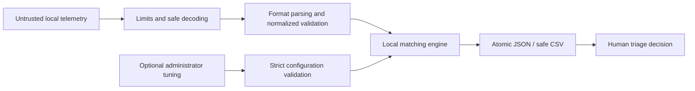

# Threat Model and Limitations

## Security position

SOC Alert Deduplicator is a local triage aid. It reduces repeated queue entries and preserves evidence; it does not determine whether activity is malicious, replace a SIEM, or authorize response actions. Its principal risk is semantic: incomplete or adversarial telemetry can still cause false merges or false splits.

## Trust boundaries

In scope:

- local telemetry, archives, and optional configuration;
- parsing, normalization, profile inference, matching, clustering, summarization, and export;
- CLI and desktop failure behavior; and
- confidentiality, integrity, and availability at those boundaries.

Out of scope:

- SIEM authentication, collection, and transport;
- database access, multi-user authorization, and audit logging;
- cloud storage and synchronization;
- malware analysis, true-positive classification, campaign attribution, containment, or remediation; and
- trust decisions about the source that produced a log.

## Assets

- **Telemetry confidentiality:** hostnames, identities, command lines, hashes, and alert descriptions may be sensitive.
- **Reference integrity:** every accepted source alert ID must appear exactly once in grouped output.
- **Cluster integrity:** unrelated identities must not be joined through missing values or similarity chaining.
- **Profile integrity:** thresholds, windows, evidence fields, and weights materially affect triage.
- **Output integrity:** failures must not be reported as successful or leave partial destination files.
- **Analyst attention:** lower queue volume must not be presented as lower security risk.

## Threat analysis

| Threat | Example | Controls | Residual risk |
|---|---|---|---|
| False merge | Similar descriptions hide different activity | Host/hash/process/target identity anchors, event checks, time boundaries, evidence thresholds, confidence and source IDs | Sparse records can omit the fields needed to separate activity |
| Similarity-chain drift | A missing-process event bridges `cmd.exe` and `powershell.exe` | Cluster retains first populated identity anchors; populated process identities must match | Vendor fields mapped incorrectly upstream can still misidentify a process |
| False split | Volatile command arguments differ | GUID, numeric, long-hex, path, case, whitespace, and token normalization | Semantic equivalents with different executable or wording can remain separate |
| Timestamp manipulation | Attacker supplies old/future or timezone-free values | Strict normalized timestamp validation; importer warnings for fallback or assumed UTC; continuity window and maximum span | Plausible but false timestamps cannot be proven locally |
| Format confusion | Syslog `<134>` resembles XML; binary data resembles text | Ordered content detection, schema markers, control-character checks, explicit binary rejection | Ambiguous plain text may receive only generic fields |
| Archive exhaustion | ZIP bomb or excessive members | 256 MiB expanded limit, 128-member cap, encrypted-member rejection, bounded read | CPU cost may still be high within allowed limits |
| Duplicate or malformed JSON | Repeated key changes parser interpretation | Duplicate-key rejection and line/column errors | CP1252 fallback can preserve imperfect vendor text rather than repair it |
| ID collision | Two files reuse the same vendor ID | Deterministic provenance suffix; final unique-ID validation | Downstream systems must treat the emitted ID as canonical for this batch |
| Unsafe overwrite | Output path equals raw input or tuning file | Protected-path comparison, sibling temporary file, atomic replacement | User can intentionally choose another sensitive destination |
| CSV formula injection | Description begins with `=`, `+`, `-`, or `@` | Leading apostrophe in CSV cells; JSON remains canonical | A downstream transformation can remove the neutralization |
| Confidentiality leak | Operational output is committed or shared | Offline runtime, ignored generated outputs, no telemetry network calls | The user controls files, screenshots, backups, and external viewers |
| Configuration tampering | Threshold is silently lowered | Strict schema/ranges, profile sidecar, deterministic profile ID, version control recommended | No signature, role approval, or trusted-policy store |

## Implemented security properties

- Inputs are treated as data and never executed.
- Text decoding rejects unsupported binary/control-heavy input.
- Expanded content and ZIP member counts are bounded.
- JSON duplicate keys and malformed JSON/JSONL records are rejected.
- Required normalized fields, timezone-aware timestamps, severities, SHA-256 shape, and unique IDs are validated.
- Unknown tuning properties, unsupported fields, and unsafe ranges are rejected.
- Matching considers only a bounded recent candidate set.
- Host, hash, source-process, target-process, event, continuity, evidence, and cluster-span boundaries constrain grouping.
- Output retains all accepted source IDs and match/profile evidence.
- JSON and CSV are atomically replaced after successful serialization.
- Input and configuration paths are protected from output collision.
- CSV cells are neutralized against common spreadsheet-formula prefixes.
- The application makes no runtime network requests.

## Operational guardrails

Before approving a dataset or tuning change:

1. Retain immutable raw telemetry separately.
2. Review the profile's detected formats, warnings, field coverage, threshold, and window.
3. Confirm the output references every accepted alert exactly once.
4. Inspect the largest clusters and any cluster dominated by missing context.
5. Review unexpected merges and splits against raw source records.
6. Compare confidence and reduction distributions before and after tuning.
7. Keep production telemetry, outputs, screenshots, and profiles out of public repositories.
8. Treat incident summaries as navigation aids, not verdicts.

## Known limitations

- Batch files only; no streaming or live SIEM connector.
- No direct binary EVTX, packet-capture, office-document, or proprietary binary parser.
- Alias-based field mapping cannot understand every vendor-specific schema.
- Plain-text fallback may infer only timestamp, generic event type, and description.
- Missing timestamps fall back to source file metadata, with a profile warning.
- The engine does not perform campaign-level graph correlation or causal analysis.
- No database, authentication, multi-user authorization, audit trail, or policy signature.
- Resource limits reduce but do not eliminate denial-of-service risk.
- Confidence describes evidence similarity inside this batch; it is not a probability that an alert is true or malicious.
- Public attack-emulation telemetry does not establish operational false-merge or false-split rates.
